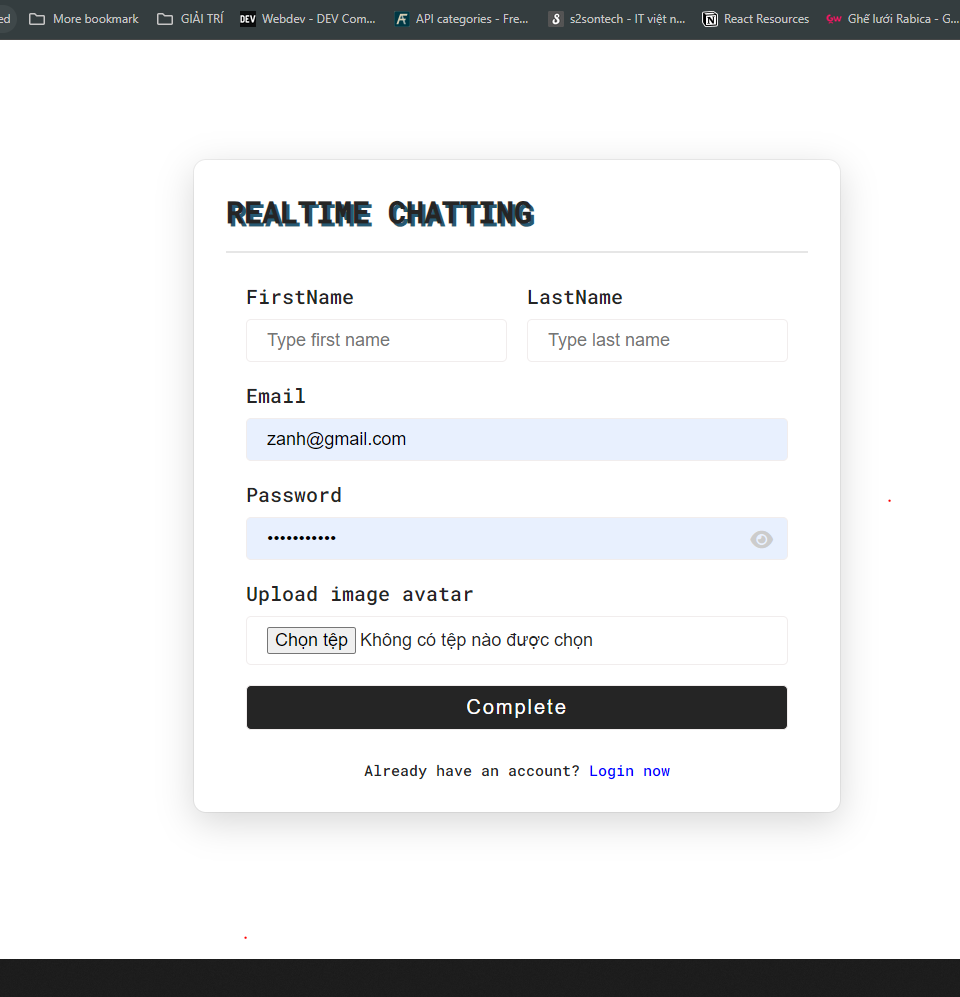
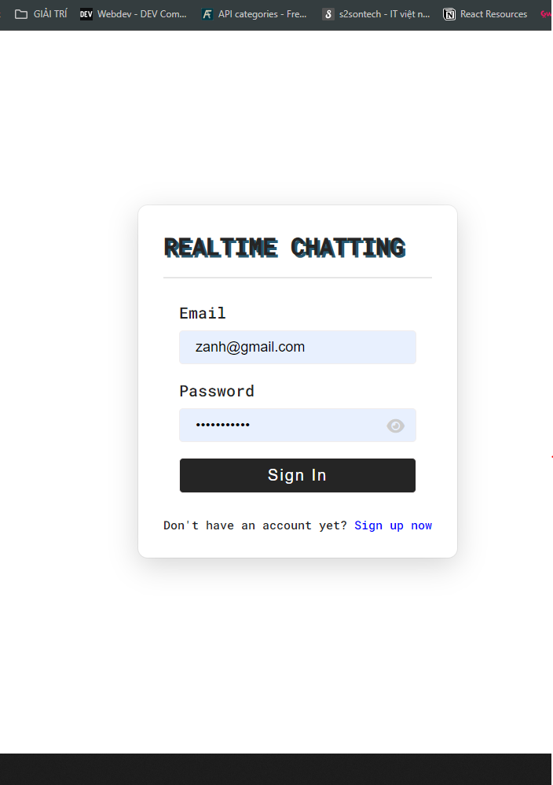
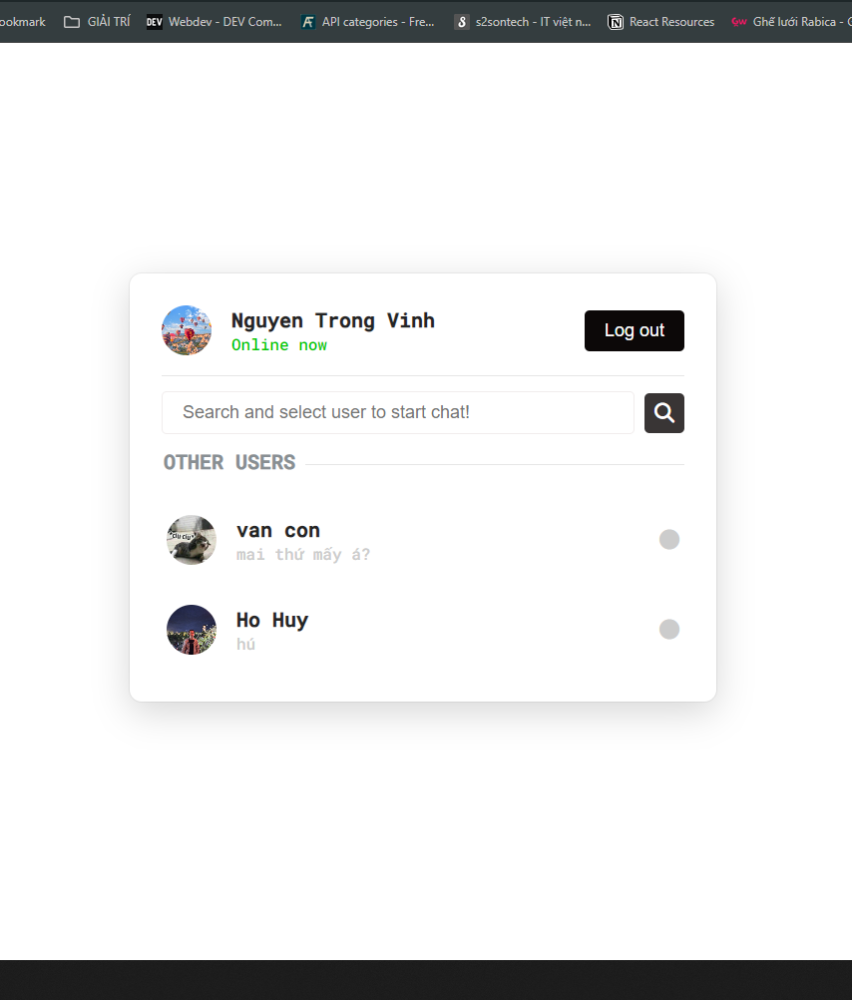
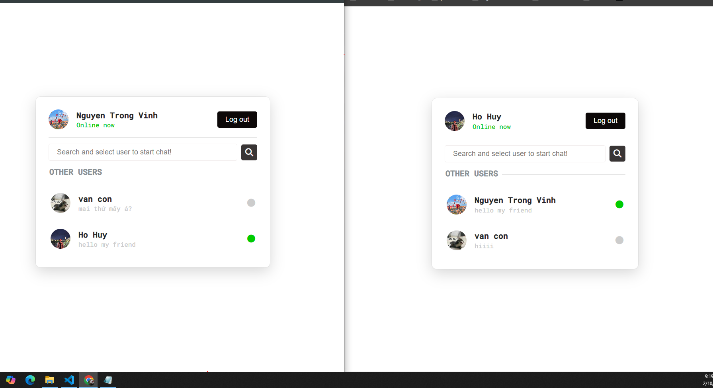
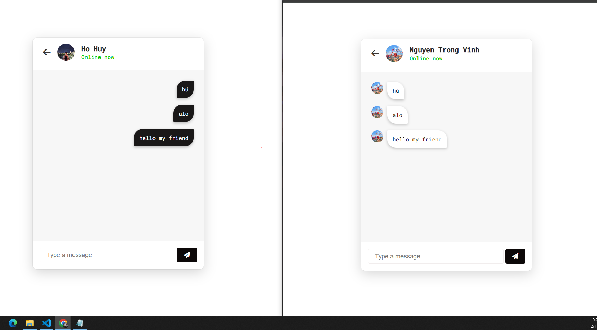

## Project PHP & MYSQL: "WEB CHAT REALTIME"
**Ứng dụng chat realtime này bao gồm những tính năng sau**
- Đăng kí, đăng nhập lưu trữ thông tin người dùng ở CSDL PHPMyAdmin
- Lưu session thông tin đăng nhập sau mỗi lần đăng nhập
- Cho phép tìm kiếm người dùng(user) khác cùng thời điểm
- Chatting với những người dùng khác 
- Xem lại những tin nhắn đã trò chuyện với user đang online hay offline
- Phân biệt người dùng online hay offline qua status user cập nhật

## Demo project trên Chrome

### 1. Giao diện sign up - sign in app chat
**Giao diện đăng kí tài khoản khi mở app**

**Giao diện đăng nhập nếu người dùng đã tạo tài khoản**

### 2. Giao diện user sau khi đăng nhập tài khoản

### 3. Giao diện realtime giữa 2 tài khoản sau khi đăng nhập

### 4. Giao diện khi xem tin nhắn đã chat với tk khác

